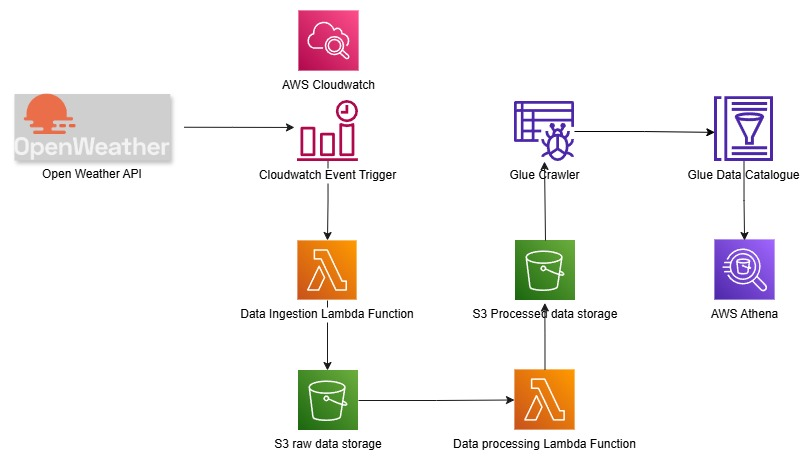

# 🌦️ OpenWeather End-to-End Data Engineering Pipeline (AWS)

A fully serverless ETL pipeline that extracts, transforms, catalogs, and queries live weather data using AWS services.  
It pulls **current weather + 5-day forecasts** from the OpenWeather API and makes them queryable with **Athena SQL**.

---

## 🗺️ Architecture

---

## ⚙️ Pipeline Flow (ETL)

1. **CloudWatch** → triggers **Lambda (Ingestion)** on schedule  
2. **Lambda (Ingestion)** → calls **OpenWeather API** → stores raw JSON → **S3 /raw/**  
3. **S3 Event** → triggers **Lambda (Processing)** → cleans/transforms → **S3 /processed/**  
4. **Glue Crawler** → builds **Data Catalog** from processed data  
5. **Athena** → run SQL queries on processed tables

---

## 🧰 Tech Stack
- AWS Lambda, CloudWatch, S3, Glue (Crawler + Data Catalog), Athena  
- Python  
- OpenWeather REST API

---

## 📂 Repository Structure (coming with next commits)
